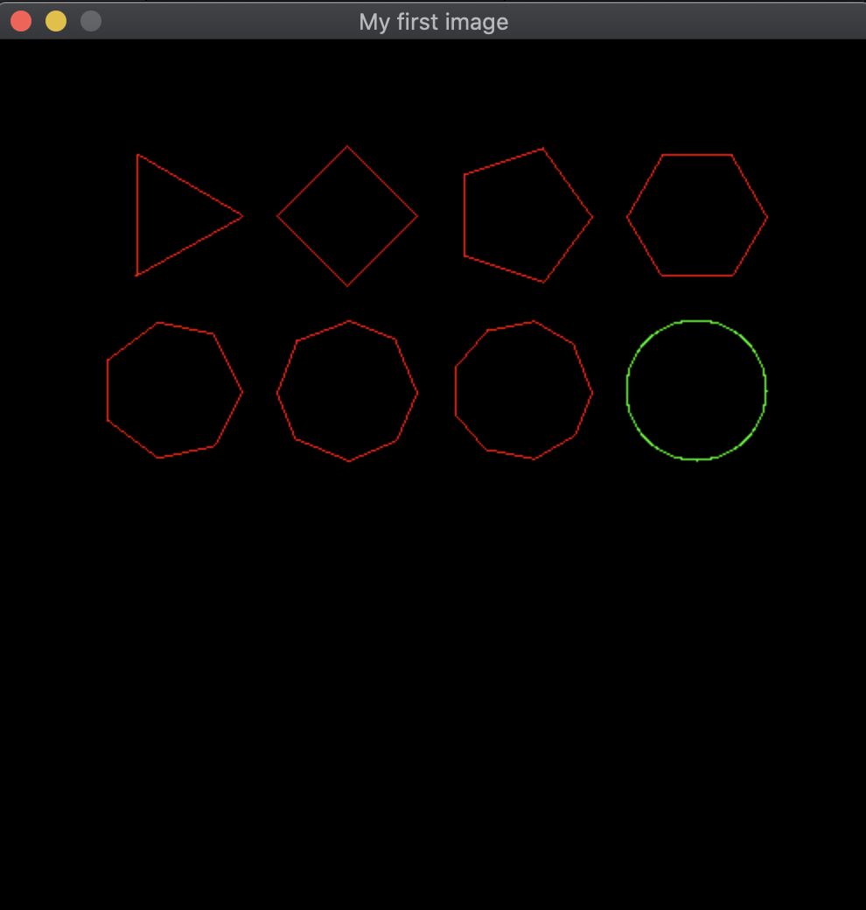
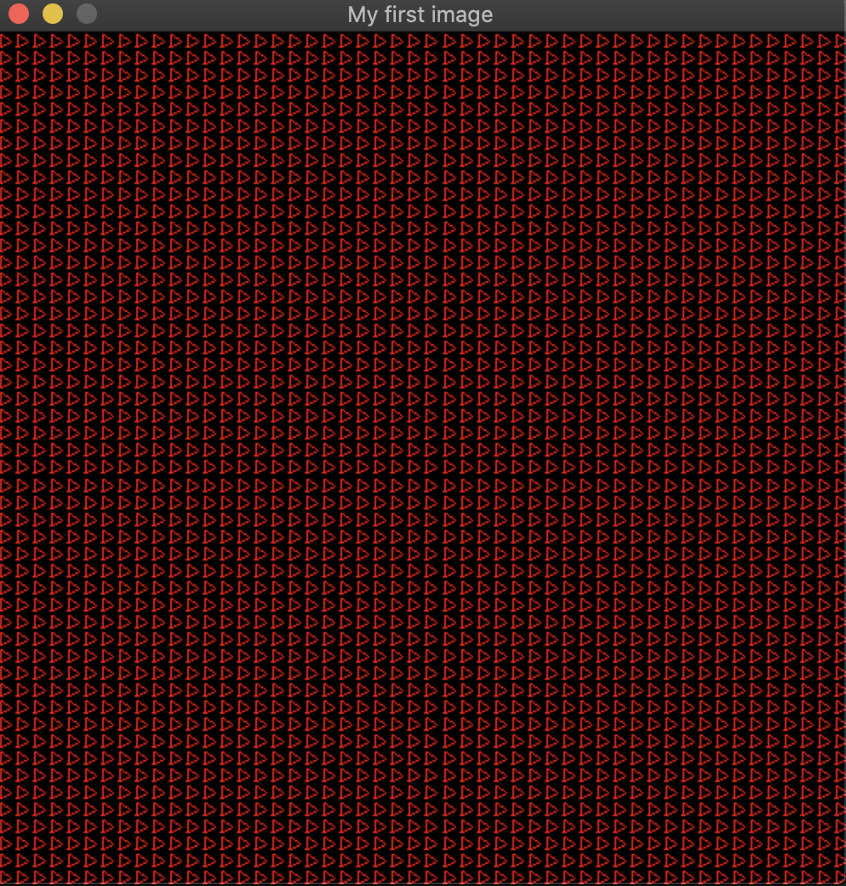

# Printing geometric shapes to a image

## How to compile

- Draw geometric shapes of n-sides:

    Inside this folder, run:

    `make geometric`

    `./a.out` 

    This will generate a window like this:

    

- Draw texture, constructing a single image a repeating it on the window in different positions:

    Inside this folder, run:

    `make texture`

    `./a.out` 

    This will generate a window like this:

    

## The code

## Draw a polygon of N-sides:

The function `void	draw_nsides(t_data *data, t_polygon polygon, int color);` is responsible for drawing a polygon in the data image.

A polygon is defined by:

- Center (Xc and Yc)
- Radius of the circle that fits outside it
- Number of sides

**Logic**:

For each side, starting from vertex located on 0 degrees and moving on counter-clockwise, we calculate the coordinates from starting and ending points of the line that constructs the side.

Then, call the function `void	draw_line(t_data *data, t_point p1, t_point p2, int color);` which draws a line connecting this 2 points

**Future:**

For future, I would like to improve the draw_nsides to make the start angle adaptable .. that way we can rotate the polygon 😉